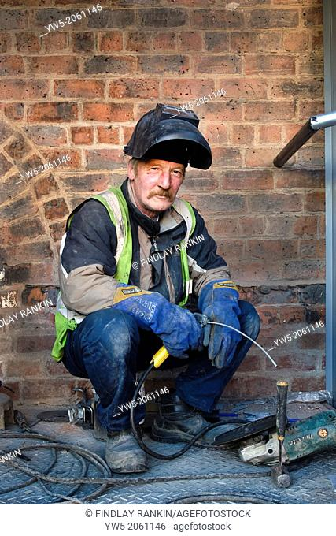
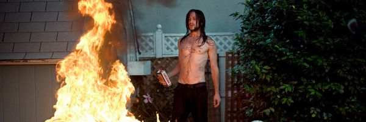
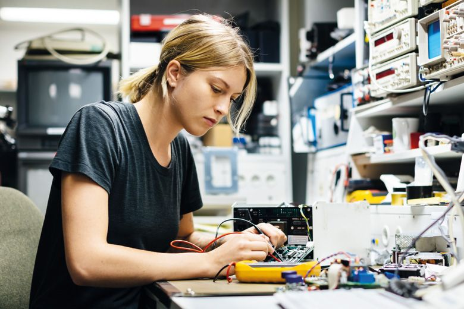

What are their wants, needs, and motivations? This is where you fully flesh out our protagonists, antagonists, ancillary characters, and more.
Take the classic RPG characters, warrior, mague, ranged and imagine them as a casual and conteporary role.

### Warrior:

- A heavy duty construction worker, with a wielder helmet, cargo pants with tool belt, vest with pockets and boots.
- His loadout grants him lots of armour and his heavy tools are his weapons.
- He is serious and doesn't talk much. Behind his mask/hemlet you can only hear him grunt.

### Mage:

- This is a pyromaniac redneck. Light on clothes, long hair and mystical.

- His clothes makes him fragile but in contrast fire shapes him as offensive one hit dangerous.

- His intelligence makes him very sharp on words. But stills crazy.

### Ranged:

- A young and girly electrical engineer tech nerd.

- She's sporty and casual. Her clothes draw her as a fast and evasive.

- She donsn't say much (pride arrogance and ego VS humble shy paceful quiet)

